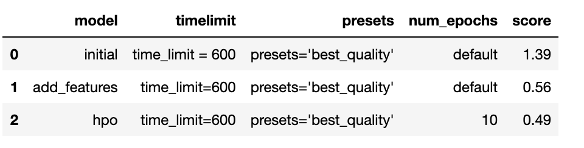
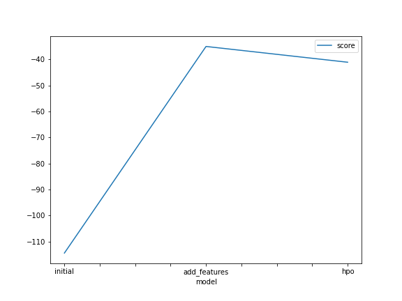
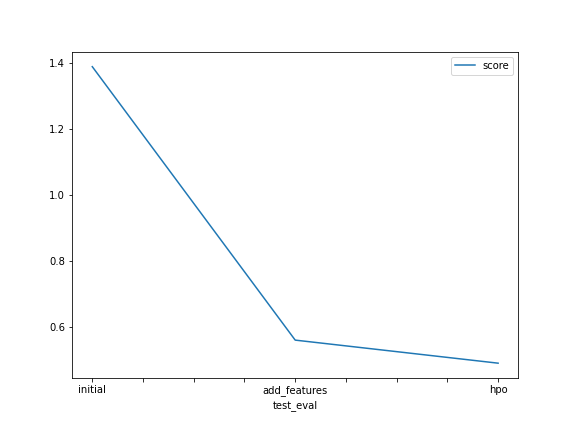

# Report: Predict Bike Sharing Demand with AutoGluon Solution
#### Raja Shekar Kilaru

## Initial Training
### What did you realize when you tried to submit your predictions? What changes were needed to the output of the predictor to submit your results?
Kaggle doesn't accept if the predictions are negative, so replaced the negative predictions to zero and submitted the results.

### What was the top ranked model that performed?
WeightedEnsemble_L3 was the top performing model during the initial training

## Exploratory data analysis and feature creation
### What did the exploratory analysis find and how did you add additional features?
The exploratory analysis revelaed that the season and weather are categorical. Also the datatime feature was splitted further in to day, month, year, hour for the models to learn better.

### How much better did your model preform after adding additional features and why do you think that is?
The model performed significantly better post adding the additional features. The validation and the test scores got better. The reason for this is because the hour feature would be explaining the variance in the demand. Before the split the model couldn't learn well from the raw timestamp feature itself.

## Hyper parameter tuning
### How much better did your model preform after trying different hyper parameters?
I didn't see the performace getting better in terms of validation score, however the score on the test/file submitted to the kaggle competition has improved with hyper parameter search.

### If you were given more time with this dataset, where do you think you would spend more time?
I would dig more in to feature engineering such as add another feature called day of the week and probably weekday/weekend feature to understand if the variance in the demand can be explained more. May be i would also try to spend more time on hyperparameter tuning such as trying out with multiple epochs, increasing the training time etc.

### Create a table with the models you ran, the hyperparameters modified, and the kaggle score.

### Create a line plot showing the top model score for the three (or more) training runs during the project.

### Create a line plot showing the top kaggle score for the three (or more) prediction submissions during the project.

## Summary
With this assignment it could use autogluon API with very basic feature engineering and hyperparameter tuning I could quickly see what models are performing well on the given dataset by checking the score on validation and test datasets (also the rank on kaggle). This saves a lot of time and helps to chose a better model and perform further more tuning to acheive the most desired/better results if i wish to continue with the experimentation.
